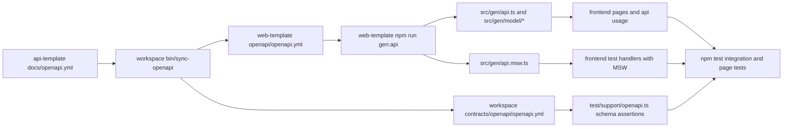

# OpenAPI Data Flow

This document explains how API contract changes move from the backend source OpenAPI file into frontend-generated types/hooks and frontend integration tests.

## End-to-End Flow

## Source of Truth

1. Backend source contract lives in [repos/api-template/docs/openapi.yml](../../api-template/docs/openapi.yml).
2. Workspace synchronization command is run from workspace root:
   - bin/sync-openapi
3. Sync updates:
   - [contracts/openapi/openapi.yml](../../../contracts/openapi/openapi.yml)
   - [repos/web-template/openapi/openapi.yml](../openapi/openapi.yml)

## Frontend Type and Hook Generation

1. Orval configuration is defined in [orval.config.ts](../orval.config.ts).
2. Generation command from web-template root:
   - npm run gen:api
3. Generation outputs:
   - [src/gen/api.ts](../src/gen/api.ts)
   - [src/gen/model](../src/gen/model)
   - [src/gen/api.msw.ts](../src/gen/api.msw.ts)

## Frontend Integration and Contract Tests

1. Runtime API calls use generated hooks/client from [src/gen/api.ts](../src/gen/api.ts).
2. Generated requests flow through [src/api/orval-fetch.ts](../src/api/orval-fetch.ts), which delegates to [src/api/client.ts](../src/api/client.ts).
3. Frontend tests use MSW handlers and server lifecycle configured in:
   - [test/setup.ts](../test/setup.ts)
   - [test/support/msw-server.ts](../test/support/msw-server.ts)
4. Contract-sensitive test helper reads workspace contract file:
   - [test/support/openapi.ts](../test/support/openapi.ts)

## Typical Change Workflow

1. Update backend contract in [repos/api-template/docs/openapi.yml](../../api-template/docs/openapi.yml).
2. From workspace root, run bin/sync-openapi.
3. From web-template root, run npm run gen:api.
4. Run npm test.
5. Run npm run build.

## Failure Triage

1. If generated hooks/types are stale:
   - Re-run bin/sync-openapi, then npm run gen:api.
2. If contract assertions fail in frontend tests:
   - Check [contracts/openapi/openapi.yml](../../../contracts/openapi/openapi.yml) and [test/support/openapi.ts](../test/support/openapi.ts).
3. If request mocking fails:
   - Confirm handlers and server setup in [test/setup.ts](../test/setup.ts) and [src/gen/api.msw.ts](../src/gen/api.msw.ts).
